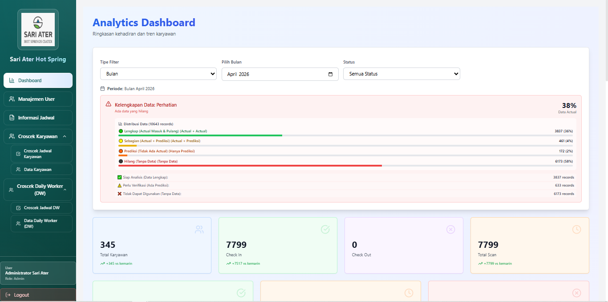
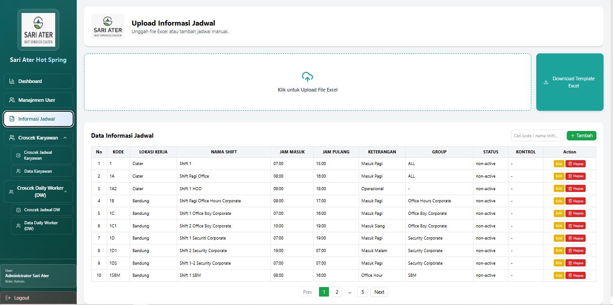
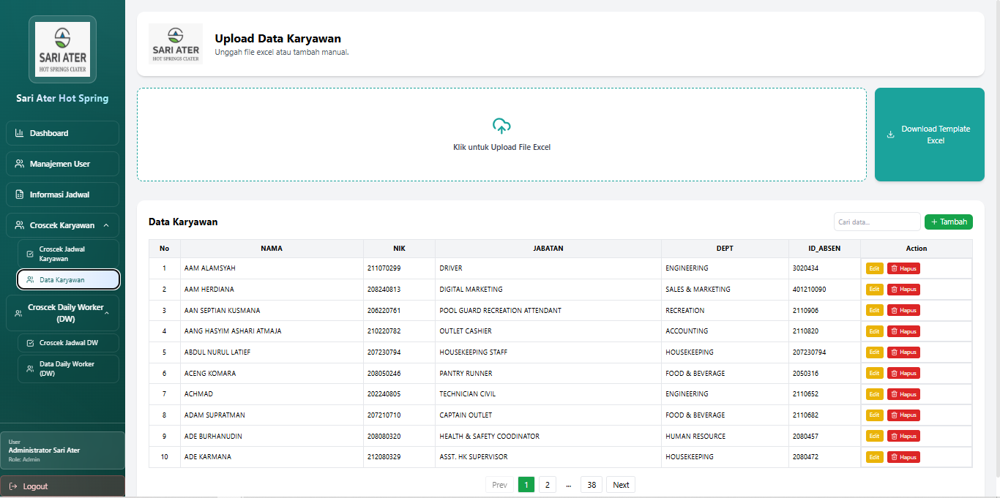
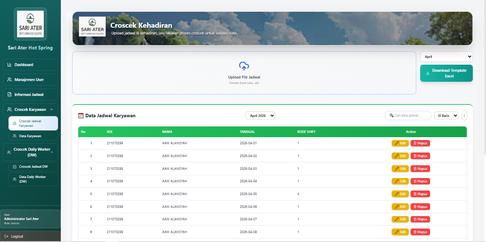
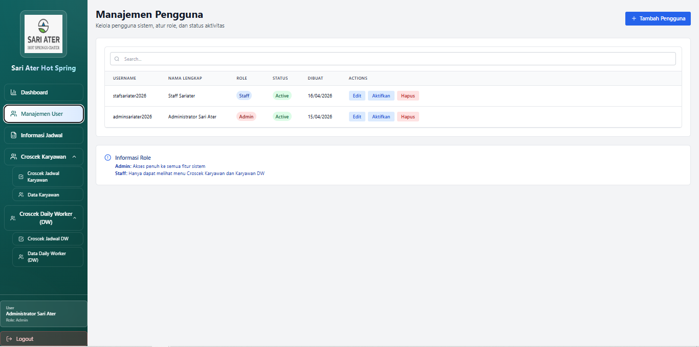

# 🎯 Croscek Kehadiran Karyawan - Frontend

Aplikasi web berbasis React untuk manajemen dan monitoring kehadiran karyawan dengan sistem croscek real-time.

---

## 📋 Daftar Isi
- [Tentang Aplikasi](#tentang-aplikasi)
- [Tools & Persyaratan](#tools--persyaratan)
- [Instalasi](#instalasi)
- [Menjalankan Aplikasi](#menjalankan-aplikasi)
- [Workflow Aplikasi](#workflow-aplikasi)
- [Fitur-Fitur](#fitur-fitur)
- [Struktur Folder](#struktur-folder)
- [Deployment](#deployment)

---

## 💼 Tentang Aplikasi

### Guna & Manfaat
**Sistem Croscek Kehadiran Karyawan** adalah aplikasi terintegrasi untuk:

✅ **Manajemen Kehadiran Karyawan**
- Track kehadiran real-time dengan sistem shift
- Monitoring keterlambatan dan keabsenan
- Analisis data kehadiran dengan visualisasi dashboard

✅ **Data Warehouse Integration**
- Integrasi dengan sistem data warehouse untuk reporting
- Historical data tracking dan analytics
- Export report dalam format Excel

✅ **Manajemen Jadwal Shift**
- CRUD jadwal kerja karyawan
- Definisi jam kerja per shift
- Schedule visualization

✅ **Manajemen Karyawan & User**
- Database karyawan lengkap (NIK, nama, departemen, jabatan)
- User management dengan role-based access (Admin/Staff)
- Authentication & authorization system

---

## 🛠 Tools & Persyaratan

### Tools yang Harus Disiapkan

| Tools | Version | Kegunaan |
|-------|---------|----------|
| **Node.js** | ≥ 18.x | Runtime JavaScript |
| **npm** | ≥ 9.x | Package manager |
| **Git** | Latest | Version control |
| **VSCode** | Latest | Code editor (optional) |

### Dependensi Utama

```json
{
  "react": "^19.2.0",
  "react-dom": "^19.2.0",
  "react-router-dom": "^7.9.6",
  "axios": "^1.15.0",
  "recharts": "^3.8.1",
  "tailwindcss": "^3.4.18",
  "vite": "^7.2.4",
  "xlsx": "^0.18.5",
  "exceljs": "^4.4.0"
}
```

---

## 📦 Instalasi

### 1. Clone Repository
```bash
cd d:\Magang\ Hub\croscek-absen
git clone <repository-url>
cd absen-frontend
```

### 2. Install Dependencies
```bash
npm install
```

### 3. Konfigurasi Environment
Buat file `.env.local` di root folder:
```env
VITE_API_URL=http://localhost:5000/api
```

Untuk production (Vercel):
```env
VITE_API_URL=https://api.yourdomain.com/api
```

### 4. Verifikasi Instalasi
```bash
npm run dev
```

Buka browser ke `http://localhost:5173`

---

## 🚀 Menjalankan Aplikasi

### Development Mode
```bash
npm run dev
```
Server berjalan di `http://localhost:5173` dengan hot reload

### Production Build
```bash
npm run build
```
Output di folder `dist/` siap untuk deploy

### Preview Build
```bash
npm run preview
```
Test production build secara lokal

### Linting
```bash
npm run lint
```
Check code quality & formatting

---

## 🔄 Workflow Aplikasi

### 1️⃣ User Login / Register
```
┌─────────────────┐
│   Login Page    │
└────────┬────────┘
         │
         ├─→ Input email & password
         ├─→ Validasi di backend
         ├─→ Token disimpan di localStorage
         │
         └─→ Redirect ke Dashboard
```

### 2️⃣ Main Dashboard
```
┌──────────────────────┐
│  Dashboard Summary   │
├──────────────────────┤
│ • Total Karyawan     │
│ • Hadir Hari Ini     │
│ • Terlambat          │
│ • Top Latecomers     │
└────────┬─────────────┘
         │
         ├─→ Charts & Analytics
         └─→ Menu Navigasi
```

### 3️⃣ Manajemen Jadwal
```
┌──────────────────┐
│ Upload Jadwal    │
├──────────────────┤
│ • Upload Excel   │
│ • Preview Data   │
│ • Save to DB     │
└────────┬─────────┘
         │
         └─→ Tersimpan di database
```

### 4️⃣ Croscek Kehadiran
```
┌──────────────────┐
│  Croscek Menu    │
├──────────────────┤
│ • Upload Absensi │
│ • Filter by Date │
│ • Mapping Jadwal │
│ • Export Report  │
└────────┬─────────┘
         │
         ├─→ Validasi vs jadwal
         ├─→ Hitung keterlambatan
         └─→ Generate report
```

### 5️⃣ Analytics & Reporting
```
┌──────────────────┐
│  Dashboard DW    │
├──────────────────┤
│ • Trend Chart    │
│ • Department     │
│ • Status Dist.   │
│ • Export Excel   │
└──────────────────┘
```

---

## ✨ Fitur-Fitur

### 1. 🔐 **Login & Authentication**

- Login dengan email & password
- Role-based access (Admin/Staff)
- Token-based authentication
- Auto logout on token expire

### 2. 📊 **Dashboard**

- Summary kehadiran hari ini
- Grafik tren kehadiran (daily, monthly)
- Top latecomers list
- Department breakdown chart
- Status distribution (Hadir, Terlambat, Izin, Sakit, Alpha)

### 3. 📅 **Informasi Jadwal**

- Upload file Excel jadwal kerja
- Preview data sebelum save
- Definisi shift (Pagi, Siang, Malam)
- Jam masuk & keluar per shift
- CRUD jadwal manual

### 4. 👥 **Data Karyawan**

- Database lengkap karyawan
- Filter by department/status
- Search by NIK/nama
- Detail karyawan per row
- Edit & hapus data

### 5. ✅ **Croscek Karyawan**

- Upload data absensi (Excel/CSV)
- Automatic mapping dengan jadwal
- Hitung keterlambatan otomatis
- Filter by date range
- Export hasil croscek

### 6. 📈 **Croscek karyawan Daily Workere**

- Upload data absensi (Excel/CSV)
- Automatic mapping dengan jadwal
- Hitung keterlambatan otomatis
- Filter by date range
- Export hasil croscek

### 7. 👨‍💼 **Manajemen User** (Admin Only)

- Create/edit/delete user
- Assign role (Admin/Staff)
- User status management
- Activity logging

### 8. 👤 **Detail Karyawan**
- Profil lengkap per karyawan
- Attendance history
- Departemen & jabatan info
- Contact information

---

## 📁 Struktur Folder

```
absen-frontend/
├── public/
│   ├── assets/
│   │   └── image/
│   │       └── tampilan-app/        # Screenshot aplikasi
│   ├── index.html
│   └── vite.svg
├── src/
│   ├── components/
│   │   ├── charts/                  # Recharts components
│   │   ├── ui/                      # Reusable UI components
│   │   ├── Sidebar.jsx
│   │   ├── ProtectedRoute.jsx
│   │   └── ...
│   ├── pages/
│   │   ├── Login.jsx                # Public route
│   │   ├── Register.jsx             # Public route
│   │   ├── Dashboard.jsx            # Main dashboard
│   │   ├── Croscek.jsx              # Croscek menu
│   │   ├── DataKaryawan.jsx
│   │   ├── UploadJadwal.jsx
│   │   └── ...
│   ├── layouts/
│   │   └── DashboardLayout.jsx      # Main layout
│   ├── context/
│   │   └── AuthContext.jsx          # Auth state management
│   ├── utils/
│   │   ├── api.js                   # Axios instance
│   │   └── formatters.js            # Helper functions
│   ├── styles/
│   │   └── Auth.css
│   ├── constants/
│   │   └── design.js                # Colors, fonts, etc
│   ├── App.jsx                      # Routes definition
│   ├── main.jsx                     # Entry point
│   └── index.css
├── package.json
├── vite.config.cjs
├── tailwind.config.js
├── postcss.config.js
├── eslint.config.js
├── .vercelignore
└── README.md
```

---

## 🌐 Deployment

### Deploy ke Vercel (Recommended)

#### 1. Persiapan
```bash
git add .
git commit -m "chore: prepare for production deployment"
git push origin main
```

#### 2. Connect ke Vercel
- Buka [vercel.com](https://vercel.com)
- Login dengan GitHub account
- Click "New Project"
- Select repository `croscek-absen`
- Configure project:
  - **Framework**: Vite
  - **Build Command**: `npm run build`
  - **Output Directory**: `dist`
  - **Environment Variables**:
    ```
    VITE_API_URL=https://api.yourdomain.com/api
    ```

#### 3. Deploy
```bash
# Automatic deploy on push
git push origin main
```

### Environment Variables (Vercel Dashboard)
```env
VITE_API_URL=<backend-api-url>
```

### Performance Tips
- ✅ Lazy loading pages (already implemented)
- ✅ Code splitting (already configured)
- ✅ CSS minification (built-in Vite)
- ✅ PWA support (with Workbox)
- ✅ Image optimization recommended

---

## 🐛 Troubleshooting

### Error: "VITE_API_URL is not defined"
**Solusi**: Pastikan `.env.local` sudah dibuat dan format benar

### Error: "data.map is not a function"
**Solusi**: Sudah diperbaiki di versi terbaru dengan array validation

### Port 5173 sudah digunakan
```bash
npm run dev -- --port 3000
```

### Build size terlalu besar
- Check dengan: `npm run build -- --report`
- Lazy loading sudah diterapkan
- Disable unused plugins di vite.config.cjs

---

## 📞 Support & Kontribusi

- 📧 Email: support@yourdomain.com
- 🐛 Report bugs: GitHub Issues
- 💡 Feature request: Discussions

---

## 📄 License

MIT License © 2026

---

## 📝 Changelog

### v1.0.0 (Current)
- ✅ Initial release
- ✅ Lazy loading & code splitting
- ✅ PWA support
- ✅ Role-based access control
- ✅ Data warehouse integration

---

**Last Updated**: April 2026
**Maintained By**: Ahmad Arif
